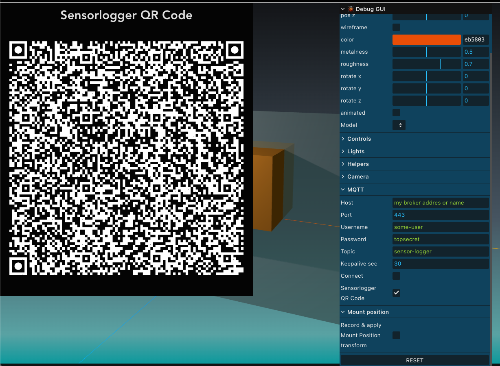

# Sensorlogger/MQTT Orientation demo

## About Sensor Logger
see https://www.tszheichoi.com/sensorlogger - great app for Citizen Scientists ;)

## try it out
demo  : https://static.mah.priv.at/apps/device-orientation/

## or build yourself:
- `npm install`
- `npm run dev` 
- it should come up like so:

- click `Debug GUI`

- set MQTT broker name or address
- adjust port as needed
- click "Connect"
- a toast notifications should confirm MQTT connect + subscribe

## configure Sensorlogger via QR Code
- in the Debug GUI, click 'Sensorlogger QR Code'
- QR Code appears:

- take picture with your mobile and import into Sensorlogger
- click the QR code to close 
- hit 'Start recording'
- move the mobile
- screen object should move accordingly

## demonstrate "mounting matrix correction"
- make sure sensorlogger is connected and pushing updates
- click 'Record & apply Mount Position transform'
- cube should revert to original position
- see page 10 of https://invensense.tdk.com/wp-content/uploads/2024/03/eMD_Software_Guide_ICM20948.pdf for an explanation

## source
this is based on:
- https://github.com/pachoclo/vite-threejs-ts-template 
- https://github.com/mqttjs/MQTT.js

## status
very rough.
